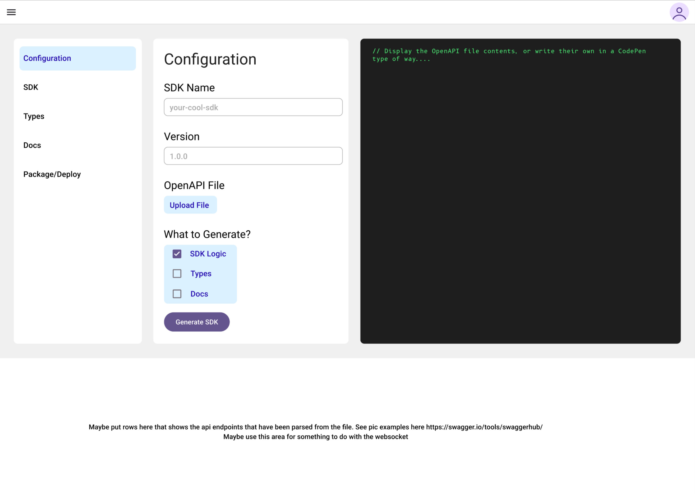

# startup
startup project for cs260, and also real pivot for my startup lol

# Specification Deliverable

## The Pitch

Building SDKs for complex multi-route multi-resource APIs is time consuming and often a big sink of developer time that could be used on something better like bug fixes, enhanced performance, and new features. 
SDK builder applications exist, but miss the mark. They are end to end and can generate types, docs, and functions in your language of choice, but for complex and unique applicaions, teams really just want to generate the model and write the logic themselves. I have set out to fix this issue.
I aim to build a program that can take an OpenAPI spec file, and generate types and allow the user to write their own logic. The program then genertes the types and docs.

## Key Features

- Generate types based on OpenAPI yaml file specifications.
- Generate docs based on OpenAPI yaml file specifications.
- Package and push the SDK to your package repo of choice.
- Maybe generate basic test cases for the SDK based on the OpenAPI spec. Not sure if users want this.
- Maybe generate SDK logic, depending on how much time I have to work on this.

## Technology Breakdown

- HTML: Will have three to four HTML pages. One auth, one to input a yaml file, another that lets you review the generated types and docs (and logic), one to package it to your package repo of choice.
- CSS: Used to style the webpages using folowing a style guide for sizes, spacing, padding, margin, and things like that. Might use M3 or GitHubs Primer system. IDK, we'll see.
- Javascript (can i use typescript here?): login, option functionality, display stored SDKs.
- React: Build components such as SDK options, a github/gitlab module, account pop up. Used for general routing.
- Backend: 
    - Login service, probably just hash them.
    - YAML parser.
    - Process parsed data and generates docs/types based on the spec.
    - Call GitHub and GitLab API for quick version control for SDKs.
- MongoDB: Stores user auth data, genrated types, and generated docs.
- Websocket: No idea what I would use a websocket for in this application. Maybe a counter of SDKs generated, or a live chat for collaboration.

## Design

## Deliverable changes

### HTML:

- I added the html to the site, with a bit of flex box styling because i hate how it looks so much.
- Added Github links, and links to the main dashboard page.

### CSS:

- I made a bunch of styling
- I defined some global variables and dynamic scaling for responsiveness. 
- Responsiveness is weird here because this seriously is NOT meant to be used on a mobile device since it is a developer tool.

### 